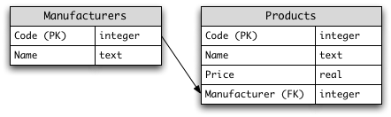

# SQL Exercises/The computer store

## Relational Schema



Please note the datatypes given are SQLite datatypes.

PK and FK stand for primary key and foreign key respectively.

```sql
CREATE TABLE Manufacturers (
    Code integer PRIMARY KEY NOT NULL,
    Name text NOT NULL
);


CREATE TABLE Products (
    Code          integer PRIMARY KEY NOT NULL,
    Name          text NOT NULL,
    Price         real NOT NULL,
    Manufacturer  integer NOT NULL CONSTRAINT fk_Manufacturers_Code REFERENCES Manufacturers (Code)
);


```

## Sample Dataset
```sql
INSERT INTO Manufacturers values ( generate_series(0,10000), md5(random()::text));

INSERT INTO Products values ( 
    generate_series(1,100000), 
    md5(random()::text),
    random()::real*10000,
    (random()*10000)::integer
);

```

OR

```
INSERT INTO Manufacturers(Code,Name) VALUES(1,'Sony');
INSERT INTO Manufacturers(Code,Name) VALUES(2,'Creative Labs');
INSERT INTO Manufacturers(Code,Name) VALUES(3,'Hewlett-Packard');
INSERT INTO Manufacturers(Code,Name) VALUES(4,'Iomega');
INSERT INTO Manufacturers(Code,Name) VALUES(5,'Fujitsu');
INSERT INTO Manufacturers(Code,Name) VALUES(6,'Winchester');

INSERT INTO Products(Code,Name,Price,Manufacturer) VALUES(1,'Hard drive',240,5);
INSERT INTO Products(Code,Name,Price,Manufacturer) VALUES(2,'Memory',120,6);
INSERT INTO Products(Code,Name,Price,Manufacturer) VALUES(3,'ZIP drive',150,4);
INSERT INTO Products(Code,Name,Price,Manufacturer) VALUES(4,'Floppy disk',5,6);
INSERT INTO Products(Code,Name,Price,Manufacturer) VALUES(5,'Monitor',240,1);
INSERT INTO Products(Code,Name,Price,Manufacturer) VALUES(6,'DVD drive',180,2);
INSERT INTO Products(Code,Name,Price,Manufacturer) VALUES(7,'CD drive',90,2);
INSERT INTO Products(Code,Name,Price,Manufacturer) VALUES(8,'Printer',270,3);
INSERT INTO Products(Code,Name,Price,Manufacturer) VALUES(9,'Toner cartridge',66,3);
INSERT INTO Products(Code,Name,Price,Manufacturer) VALUES(10,'DVD burner',180,2);
```

## Exercises

1. Select the names of all the products in the store.

```sql
SELECT * FROM Products;
```

2. Select the names and the prices of all the products in the store.

```sql
SELECT Name, Price FROM Products;
```


3. Select the name of the products with a price less than or equal to $200.

```sql
SELECT Name FROM Products WHERE Price<=200;
```

4. Select all the products with a price between $60 and $120.

```sql
SELECT * FROM Products WHERE Price<=120 AND Price>=60;

SELECT * FROM Products WHERE Price BETWEEN 60 AND 120;
```

5. Select the name and price in cents (i.e., the price must be multiplied by 100).

```sql
SELECT Name, Price * 100 FROM Products;
 

SELECT Name, Price * 100 AS PriceCents FROM Products;
```

6. Compute the average price of all the products.

```sql
SELECT AVG(Price) FROM Products;
```

7. Compute the average price of all products with manufacturer code equal to 2.

```sql
SELECT AVG(Price) FROM Products WHERE Manufacturer=2;
```

8. Compute the number of products with a price larger than or equal to $180.

```sql
SELECT count(*) FROM Products WHERE Price >= 180;
```

9. Select the name and price of all products with a price larger than or equal to $180, and sort first by price (in descending order), and then by name (in ascending order).

```sql
SELECT Name, Price FROM Products WHERE Price >= 180 ORDER BY Price DESC, Name ASC;
```

10. Select all the data from the products, including all the data for each product's manufacturer.

```sql
SELECT * FROM Products, Manufacturers WHERE Products.Manufacturer = Manufacturers.Code;

SELECT * FROM Products INNER JOIN Manufacturers ON Products.Manufacturer = Manufacturers.Code;
```

11. Select the product name, price, and manufacturer name of all the products.

```sql
SELECT Products.Name, Price, Manufacturers.Name
  FROM Products, Manufacturers
  WHERE Products.Manufacturer = Manufacturers.Code;

SELECT Products.Name, Price, Manufacturers.Name 
  FROM Products INNER JOIN Manufacturers 
  ON Products.Manufacturer = Manufacturers.Code;
```

12. Select the average price of each manufacturer's products, showing only the manufacturer's code.

```sql
SELECT AVG(Price), Manufacturer FROM Products GROUP BY Manufacturer;
```

13. Select the average price of each manufacturer's products, showing the manufacturer's name.

```sql
SELECT AVG(Price), Manufacturers.Name
  FROM Products, Manufacturers
  WHERE Products.Manufacturer = Manufacturers.Code
  GROUP BY Manufacturers.Name;

SELECT AVG(Price), Manufacturers.Name 
  FROM Products INNER JOIN Manufacturers 
  ON Products.Manufacturer = Manufacturers.Code
  GROUP BY Manufacturers.Name;
```

14. Select the names of manufacturer whose products have an average price larger than or equal to $150.

```sql
 /* Without INNER JOIN */
SELECT AVG(Price), Manufacturers.Name
  FROM Products, Manufacturers
  WHERE Products.Manufacturer = Manufacturers.Code
  GROUP BY Manufacturers.Name
  HAVING AVG(Price) >= 150;

/* HAVING与WHERE不同： WHERE会在应用GROUP BY之前过滤个体行，而HAVING过滤由 GROUP BY创建的分组行。 */

SELECT AVG(Price), Manufacturers.Name
  FROM Products, Manufacturers
  WHERE Products.Manufacturer = Manufacturers.Code
  GROUP BY Manufacturers.Name
  HAVING AVG(Price) >= 150;
```


15. Select the name and price of the cheapest product.

```sql
SELECT Name, Price FROM Products ORDER BY Price ASC LIMIT 1;

SELECT Name, Price FROM Products WHERE Price=(SELECT MIN(Price) FROM Products);
```

16. Select the name of each manufacturer along with the name and price of its most expensive product.

https://stackoverflow.com/questions/45126123/use-groupy-by-to-get-the-name-and-price-of-its-most-expensive-product

The following query will give the most expensive price for each manufacturer product. 
It will return multiple products in the event of a tie. If you just want one product 
per manufacturer regardless of a tie, replace DENSE_RANK with ROW_NUMBER.

```sql
SELECT
    t.m_name,
    t.p_name,
    t.Price
FROM
(
    SELECT
        t1.Name AS m_name,
        COALESCE(t2.Name, 'NA') AS p_name,
        COALESCE(t2.Price, 0.0) AS price,
        DENSE_RANK() OVER (PARTITION BY t1.Code ORDER BY t2.Price DESC) dr
    FROM Manufacturers t1
    LEFT JOIN Products t2
        ON t1.Code = t2.Manufacturer
) t
WHERE t.dr = 1;
```


```sql
SELECT Manufacturers.Name AS ManufacturersName, MAX(Price)
  FROM Products, Manufacturers
  WHERE Products.Manufacturer = Manufacturers.Code
  GROUP BY Manufacturers.Name;

SELECT manufacturersname, max, Products.Name 
FROM 
  (
    SELECT Manufacturers.Name AS ManufacturersName, MAX(Price)
      FROM Products, Manufacturers
      WHERE Products.Manufacturer = Manufacturers.Code
      GROUP BY Manufacturers.Name
  ) AS subtable, Products
WHERE subtable.max=Products.Price;


SELECT A.Name, A.Price, F.Name
  FROM Products A INNER JOIN Manufacturers F
  ON A.Manufacturer = F.Code
  AND A.Price =
    (
      SELECT MAX(A.Price)
        FROM Products A
        WHERE A.Manufacturer = F.Code
    );
```

17. Add a new product: Loudspeakers, $70, manufacturer 2.

```sql
INSERT INTO Products( Name , Price , Manufacturer) VALUES ( 'Loudspeakers' , 70 , 2 );
```

18. Update the name of product 8 to "Laser Printer".

```sql
UPDATE Products
  SET Name = 'Laser Printer'
  WHERE Code = 8;
```

19. Apply a 10% discount to all products.

```sql
UPDATE Products
  SET Price = Price * 0.9;
```

20. Apply a 10% discount to all products with a price larger than or equal to $120.

```sql
UPDATE Products
  SET Price = Price * 0.9
  WHERE Price >= 120;
```


