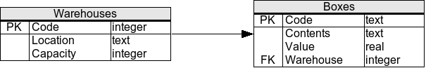

# SQL Exercises/The warehouse

## Relational Schema

`Oracle12c`



```sql
CREATE TABLE Warehouses (
 code INTEGER PRIMARY KEY NOT NULL,
 location VARCHAR2 (255) NOT NULL,
 capacity INTEGER NOT NULL
);

CREATE TABLE Boxes (
 code VARCHAR2 (255) PRIMARY KEY NOT NULL,
 contents VARCHAR2 (255) NOT NULL,
 value REAL NOT NULL,
 warehouse INTEGER NOT NULL,
 CONSTRAINT fk_warehouses_code FOREIGN KEY (warehouse) REFERENCES Warehouses(code)
);
```

## Sample Dataset
```sql
 INSERT INTO Warehouses(Code,Location,Capacity) VALUES(1,'Chicago',3);
 INSERT INTO Warehouses(Code,Location,Capacity) VALUES(2,'Chicago',4);
 INSERT INTO Warehouses(Code,Location,Capacity) VALUES(3,'New York',7);
 INSERT INTO Warehouses(Code,Location,Capacity) VALUES(4,'Los Angeles',2);
 INSERT INTO Warehouses(Code,Location,Capacity) VALUES(5,'San Francisco',8);
 
 INSERT INTO Boxes(Code,Contents,Value,Warehouse) VALUES('0MN7','Rocks',180,3);
 INSERT INTO Boxes(Code,Contents,Value,Warehouse) VALUES('4H8P','Rocks',250,1);
 INSERT INTO Boxes(Code,Contents,Value,Warehouse) VALUES('4RT3','Scissors',190,4);
 INSERT INTO Boxes(Code,Contents,Value,Warehouse) VALUES('7G3H','Rocks',200,1);
 INSERT INTO Boxes(Code,Contents,Value,Warehouse) VALUES('8JN6','Papers',75,1);
 INSERT INTO Boxes(Code,Contents,Value,Warehouse) VALUES('8Y6U','Papers',50,3);
 INSERT INTO Boxes(Code,Contents,Value,Warehouse) VALUES('9J6F','Papers',175,2);
 INSERT INTO Boxes(Code,Contents,Value,Warehouse) VALUES('LL08','Rocks',140,4);
 INSERT INTO Boxes(Code,Contents,Value,Warehouse) VALUES('P0H6','Scissors',125,1);
 INSERT INTO Boxes(Code,Contents,Value,Warehouse) VALUES('P2T6','Scissors',150,2);
 INSERT INTO Boxes(Code,Contents,Value,Warehouse) VALUES('TU55','Papers',90,5);
```

## Exercises

1 Select all warehouses.

```sql
SELECT * FROM warehouses
```

2 Select all boxes with a value larger than $150.

```sql
SELECT * FROM boxes WHERE VALUE > 150
```

3 Select all distinct contents in all the boxes.

```sql
SELECT DISTINCT contents FROM boxes
```

4 Select the average value of all the boxes.

```sql
SELECT AVG(value) FROM boxes
```

5 Select the warehouse code and the average value of the boxes in each warehouse.

```sql
SELECT warehouse, COUNT(*) FROM boxes GROUP BY warehouse
```

6 Same as previous exercise, but select only those warehouses where the average value of the boxes is greater than 150.

```sql
SELECT warehouse, AVG(value) FROM boxes GROUP BY warehouse HAVING AVG(value) > 150
```

7 Select the code of each box, along with the name of the city the box is located in.

```sql
SELECT B.code, W.location
  FROM boxes B
  LEFT JOIN warehouses W
    ON B.warehouse = W.code
```

8 Select the warehouse codes, along with the number of boxes in each warehouse. Optionally, take into account that some warehouses are empty (i.e., the box count should show up as zero, instead of omitting the warehouse from the result).

```sql
SELECT W.code, count(B.code)
  FROM warehouses W
  LEFT JOIN boxes B
    ON W.code = B.warehouse
 GROUP By (W.code)
```

9 Select the codes of all warehouses that are saturated (a warehouse is saturated if the number of boxes in it is larger than the warehouse's capacity).

```sql
SELECT *
  FROM warehouses
 WHERE capacity <
       (SELECT count(*) FROM boxes WHERE warehouse = warehouses.code)

SELECT warehouses.Code
  FROM warehouses JOIN boxes ON warehouses.code = boxes.warehouse
  GROUP BY warehouses.code,warehouses.capacity 
  HAVING Count(boxes.code) > warehouses.capacity

-- for postgresql
SELECT warehouses.Code
  FROM warehouses JOIN boxes ON warehouses.code = boxes.warehouse
  GROUP BY warehouses.code
  HAVING Count(boxes.code) > warehouses.capacity
```

10 Select the codes of all the boxes located in Chicago.

```sql
SELECT code
  FROM boxes
 WHERE warehouse IN
       (SELECT code FROM warehouses WHERE location = 'Chicago')

 SELECT Boxes.Code
   FROM Warehouses LEFT JOIN Boxes
   ON Warehouses.Code = Boxes.Warehouse
   WHERE Location = 'Chicago';
```

11 Create a new warehouse in New York with a capacity for 3 boxes.

```sql
INSERT INTO Warehouses (Location, Capacity) VALUES ('New York', 3);
```

12 Create a new box, with code "H5RT", containing "Papers" with a value of $200, and located in warehouse 2.

```sql
 INSERT INTO Boxes VALUES('H5RT','Papers',200,2);
```

13 Reduce the value of all boxes by 15%.

```sql
 UPDATE Boxes SET Value = Value * 0.85;
```

14 Apply a 20% value reduction to boxes with a value larger than the average value of all the boxes.

```sql
 UPDATE boxes SET value = value * 0.8 WHERE value > (SELECT AVG(value) FROM boxes)
```

15 Remove all boxes with a value lower than $100.

```sql
DELETE FROM Boxes WHERE Value < 100;
```

16 Remove all boxes from saturated warehouses.

```sql
DELETE FROM boxes
 WHERE warehouse IN
       (SELECT code
          FROM warehouses
         WHERE capacity < (SELECT count(code)
                             FROM boxes
                            WHERE warehouse = warehouses.code))
```

