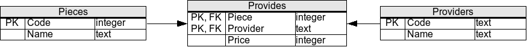

# SQL Exercises/Pieces and providers

## Relational Schema

`Oracle12c`



```sql
 CREATE TABLE Movies (
   Code INTEGER PRIMARY KEY,
   Title VARCHAR(255) NOT NULL,
   Rating VARCHAR(255) 
 );
 
 CREATE TABLE MovieTheaters (
   Code INTEGER PRIMARY KEY,
   Name VARCHAR(255) NOT NULL,
   Movie INTEGER,  
     FOREIGN KEY (Movie) REFERENCES Movies(Code)
 ) ;
```

## Sample Dataset
```sql
 INSERT INTO Movies(Code,Title,Rating) VALUES(9,'Citizen King','G');
 INSERT INTO Movies(Code,Title,Rating) VALUES(1,'Citizen Kane','PG');
 INSERT INTO Movies(Code,Title,Rating) VALUES(2,'Singin'' in the Rain','G');
 INSERT INTO Movies(Code,Title,Rating) VALUES(3,'The Wizard of Oz','G');
 INSERT INTO Movies(Code,Title,Rating) VALUES(4,'The Quiet Man',NULL);
 INSERT INTO Movies(Code,Title,Rating) VALUES(5,'North by Northwest',NULL);
 INSERT INTO Movies(Code,Title,Rating) VALUES(6,'The Last Tango in Paris','NC-17');
 INSERT INTO Movies(Code,Title,Rating) VALUES(7,'Some Like it Hot','PG-13');
 INSERT INTO Movies(Code,Title,Rating) VALUES(8,'A Night at the Opera',NULL);
 
 INSERT INTO MovieTheaters(Code,Name,Movie) VALUES(1,'Odeon',5);
 INSERT INTO MovieTheaters(Code,Name,Movie) VALUES(2,'Imperial',1);
 INSERT INTO MovieTheaters(Code,Name,Movie) VALUES(3,'Majestic',NULL);
 INSERT INTO MovieTheaters(Code,Name,Movie) VALUES(4,'Royale',6);
 INSERT INTO MovieTheaters(Code,Name,Movie) VALUES(5,'Paraiso',3);
 INSERT INTO MovieTheaters(Code,Name,Movie) VALUES(6,'Nickelodeon',NULL);
```

## Exercises

1 Obtain the average price of each piece (show only the piece code and the average price).

```sql
SELECT Piece, AVG(Price) FROM Provides GROUP BY Piece;
```

2 Obtain the names of all providers who supply piece 1.

```sql
SELECT *
FROM providers
WHERE code IN
  (SELECT provider FROM provides WHERE piece=1
  );

SELECT Providers.Name
FROM Providers
INNER JOIN Provides
ON Providers.Code  = Provides.Provider
AND Provides.Piece = 1;
```
3 **Select the name of pieces provided by provider with code "HAL".**

```sql
SELECT name
FROM pieces
WHERE code IN
  ( SELECT piece FROM provides WHERE provider='HAL'
  )

SELECT pieces.name
FROM pieces
INNER JOIN provides
ON pieces.code       = provides.piece
AND provides.provider='HAL'

SELECT Name
FROM Pieces
where exists
  ( SELECT * FROM Provides WHERE Provider = 'HAL' AND Piece = Pieces.Code
  );
```

4 **For each piece, find the most expensive offering of that piece and include the piece name, provider name, and price (note that there could be two providers who supply the same piece at the most expensive price).**

```sql
SELECT Pieces.Name,
  Providers.Name,
  Price
FROM Pieces
INNER JOIN Provides
ON Pieces.Code = Piece
INNER JOIN Providers
ON Providers.Code = Provider
WHERE Price       =
  ( SELECT MAX(Price) FROM Provides WHERE Piece = Pieces.Code
  );


```

5 Add an entry to the database to indicate that "Skellington Supplies" (code "TNBC") will provide sprockets (code "1") for 7 cents each.

```sql
INSERT INTO provides VALUES (1, 'TNBC', 7);
```

6 Increase all prices by one cent.

```sql
UPDATE Provides SET Price = Price + 1;
```

7 Update the database to reflect that "Susan Calvin Corp." (code "RBT") will not supply bolts (code 4).

```sql
DELETE FROM Provides WHERE Provider = 'RBT' AND Piece = 4;
```

8 Update the database to reflect that "Susan Calvin Corp." (code "RBT") will not supply any pieces (the provider should still remain in the database).

```sql
DELETE FROM Provides WHERE Provider = 'RBT';
```
