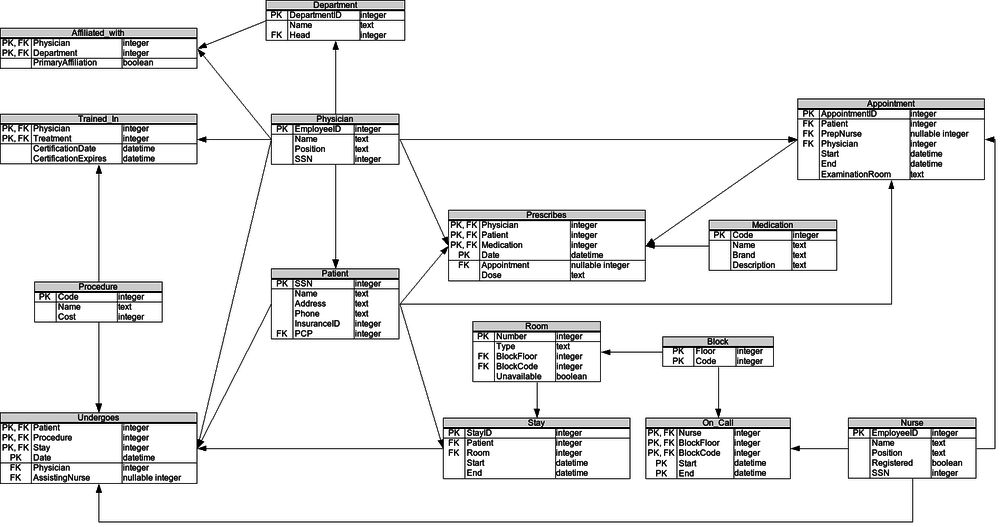

# SQL Exercises/The Hospital

## Relational Schema

`Postgresql10.1`



```sql
CREATE TABLE Physician (
  EmployeeID INTEGER PRIMARY KEY NOT NULL,
  Name TEXT NOT NULL,
  Position TEXT NOT NULL,
  SSN INTEGER NOT NULL
); 

CREATE TABLE Department (
  DepartmentID INTEGER PRIMARY KEY NOT NULL,
  Name TEXT NOT NULL,
  Head INTEGER NOT NULL
    CONSTRAINT fk_Physician_EmployeeID REFERENCES Physician(EmployeeID)
);

CREATE TABLE Affiliated_With (
  Physician INTEGER NOT NULL
    CONSTRAINT fk_Physician_EmployeeID REFERENCES Physician(EmployeeID),
  Department INTEGER NOT NULL
    CONSTRAINT fk_Department_DepartmentID REFERENCES Department(DepartmentID),
  PrimaryAffiliation BOOLEAN NOT NULL,
  PRIMARY KEY(Physician, Department)
);

CREATE TABLE Procedure (
  Code INTEGER PRIMARY KEY NOT NULL,
  Name TEXT NOT NULL,
  Cost REAL NOT NULL
);

CREATE TABLE Trained_In (
  Physician INTEGER NOT NULL
    CONSTRAINT fk_Physician_EmployeeID REFERENCES Physician(EmployeeID),
  Treatment INTEGER NOT NULL
    CONSTRAINT fk_Procedure_Code REFERENCES Procedure(Code),
  CertificationDate DATE NOT NULL,
  CertificationExpires DATE NOT NULL,
  PRIMARY KEY(Physician, Treatment)
);

CREATE TABLE Patient (
  SSN INTEGER PRIMARY KEY NOT NULL,
  Name TEXT NOT NULL,
  Address TEXT NOT NULL,
  Phone TEXT NOT NULL,
  InsuranceID INTEGER NOT NULL,
  PCP INTEGER NOT NULL
    CONSTRAINT fk_Physician_EmployeeID REFERENCES Physician(EmployeeID)
);

CREATE TABLE Nurse (
  EmployeeID INTEGER PRIMARY KEY NOT NULL,
  Name TEXT NOT NULL,
  Position TEXT NOT NULL,
  Registered BOOLEAN NOT NULL,
  SSN INTEGER NOT NULL
);

CREATE TABLE Appointment (
  AppointmentID INTEGER PRIMARY KEY NOT NULL,
  Patient INTEGER NOT NULL
    CONSTRAINT fk_Patient_SSN REFERENCES Patient(SSN),
  PrepNurse INTEGER
    CONSTRAINT fk_Nurse_EmployeeID REFERENCES Nurse(EmployeeID),
  Physician INTEGER NOT NULL
    CONSTRAINT fk_Physician_EmployeeID REFERENCES Physician(EmployeeID),
  Start DATE NOT NULL,
  "End" DATE NOT NULL,
  ExaminationRoom TEXT NOT NULL
);

  
CREATE TABLE Medication (
  Code INTEGER PRIMARY KEY NOT NULL,
  Name TEXT NOT NULL,
  Brand TEXT NOT NULL,
  Description TEXT NOT NULL
);

CREATE TABLE Prescribes (
  Physician INTEGER NOT NULL
    CONSTRAINT fk_Physician_EmployeeID REFERENCES Physician(EmployeeID),
  Patient INTEGER NOT NULL
    CONSTRAINT fk_Patient_SSN REFERENCES Patient(SSN),
  Medication INTEGER NOT NULL
    CONSTRAINT fk_Medication_Code REFERENCES Medication(Code),
  Date DATE NOT NULL,
  Appointment INTEGER
    CONSTRAINT fk_Appointment_AppointmentID REFERENCES Appointment(AppointmentID),
  Dose TEXT NOT NULL,
  PRIMARY KEY(Physician, Patient, Medication, Date)
);

CREATE TABLE Block (
  Floor INTEGER NOT NULL,
  Code INTEGER NOT NULL,
  PRIMARY KEY(Floor, Code)
); 

CREATE TABLE Room (
  Number INTEGER PRIMARY KEY NOT NULL,
  Type TEXT NOT NULL,
  BlockFloor INTEGER NOT NULL,
  BlockCode INTEGER NOT NULL,
  Unavailable BOOLEAN NOT NULL,
  CONSTRAINT fk_Room_Block_PK FOREIGN KEY(BlockFloor, BlockCode) REFERENCES Block(Floor, Code)
);

CREATE TABLE On_Call (
  Nurse INTEGER NOT NULL
    CONSTRAINT fk_Nurse_EmployeeID REFERENCES Nurse(EmployeeID),
  BlockFloor INTEGER NOT NULL,
  BlockCode INTEGER NOT NULL,
  Start DATE NOT NULL,
  "End" DATE NOT NULL,
  PRIMARY KEY(Nurse, BlockFloor, BlockCode, Start, "End"),
  CONSTRAINT fk_OnCall_Nurse_EmployeeID FOREIGN KEY(Nurse) REFERENCES Nurse(EmployeeID),
  CONSTRAINT fk_OnCall_Block_Floor FOREIGN KEY(BlockFloor, BlockCode) REFERENCES Block(Floor, Code) 
);

CREATE TABLE Stay (
  StayID INTEGER PRIMARY KEY NOT NULL,
  Patient INTEGER NOT NULL
    CONSTRAINT fk_Patient_SSN REFERENCES Patient(SSN),
  Room INTEGER NOT NULL
    CONSTRAINT fk_Room_Number REFERENCES Room(Number),
  Start DATE NOT NULL,
  "End" DATE NOT NULL
);

CREATE TABLE Undergoes (
  Patient INTEGER NOT NULL
    CONSTRAINT fk_Patient_SSN REFERENCES Patient(SSN),
  Procedure INTEGER NOT NULL
    CONSTRAINT fk_Procedure_Code REFERENCES Procedure(Code),
  Stay INTEGER NOT NULL
    CONSTRAINT fk_Stay_StayID REFERENCES Stay(StayID),
  Date DATE NOT NULL,
  Physician INTEGER NOT NULL
    CONSTRAINT fk_Physician_EmployeeID REFERENCES Physician(EmployeeID),
  AssistingNurse INTEGER
    CONSTRAINT fk_Nurse_EmployeeID REFERENCES Nurse(EmployeeID),
  PRIMARY KEY(Patient, Procedure, Stay, Date)
);
```

## Sample Dataset
```sql
INSERT INTO Physician VALUES(1,'John Dorian','Staff Internist',111111111);
INSERT INTO Physician VALUES(2,'Elliot Reid','Attending Physician',222222222);
INSERT INTO Physician VALUES(3,'Christopher Turk','Surgical Attending Physician',333333333);
INSERT INTO Physician VALUES(4,'Percival Cox','Senior Attending Physician',444444444);
INSERT INTO Physician VALUES(5,'Bob Kelso','Head Chief of Medicine',555555555);
INSERT INTO Physician VALUES(6,'Todd Quinlan','Surgical Attending Physician',666666666);
INSERT INTO Physician VALUES(7,'John Wen','Surgical Attending Physician',777777777);
INSERT INTO Physician VALUES(8,'Keith Dudemeister','MD Resident',888888888);
INSERT INTO Physician VALUES(9,'Molly Clock','Attending Psychiatrist',999999999);

INSERT INTO Department VALUES(1,'General Medicine',4);
INSERT INTO Department VALUES(2,'Surgery',7);
INSERT INTO Department VALUES(3,'Psychiatry',9);

INSERT INTO Affiliated_With VALUES(1,1,TRUE);
INSERT INTO Affiliated_With VALUES(2,1,TRUE);
INSERT INTO Affiliated_With VALUES(3,1,FALSE);
INSERT INTO Affiliated_With VALUES(3,2,TRUE);
INSERT INTO Affiliated_With VALUES(4,1,TRUE);
INSERT INTO Affiliated_With VALUES(5,1,TRUE);
INSERT INTO Affiliated_With VALUES(6,2,TRUE);
INSERT INTO Affiliated_With VALUES(7,1,FALSE);
INSERT INTO Affiliated_With VALUES(7,2,TRUE);
INSERT INTO Affiliated_With VALUES(8,1,TRUE);
INSERT INTO Affiliated_With VALUES(9,3,TRUE);

INSERT INTO Procedure VALUES(1,'Reverse Rhinopodoplasty',1500.0);
INSERT INTO Procedure VALUES(2,'Obtuse Pyloric Recombobulation',3750.0);
INSERT INTO Procedure VALUES(3,'Folded Demiophtalmectomy',4500.0);
INSERT INTO Procedure VALUES(4,'Complete Walletectomy',10000.0);
INSERT INTO Procedure VALUES(5,'Obfuscated Dermogastrotomy',4899.0);
INSERT INTO Procedure VALUES(6,'Reversible Pancreomyoplasty',5600.0);
INSERT INTO Procedure VALUES(7,'Follicular Demiectomy',25.0);

INSERT INTO Patient VALUES(100000001,'John Smith','42 Foobar Lane','555-0256',68476213,1);
INSERT INTO Patient VALUES(100000002,'Grace Ritchie','37 Snafu Drive','555-0512',36546321,2);
INSERT INTO Patient VALUES(100000003,'Random J. Patient','101 Omgbbq Street','555-1204',65465421,2);
INSERT INTO Patient VALUES(100000004,'Dennis Doe','1100 Foobaz Avenue','555-2048',68421879,3);

INSERT INTO Nurse VALUES(101,'Carla Espinosa','Head Nurse',TRUE,111111110);
INSERT INTO Nurse VALUES(102,'Laverne Roberts','Nurse',TRUE,222222220);
INSERT INTO Nurse VALUES(103,'Paul Flowers','Nurse',FALSE,333333330);

INSERT INTO Appointment VALUES(13216584,100000001,101,1,'2008-04-24 10:00','2008-04-24 11:00','A');
INSERT INTO Appointment VALUES(26548913,100000002,101,2,'2008-04-24 10:00','2008-04-24 11:00','B');
INSERT INTO Appointment VALUES(36549879,100000001,102,1,'2008-04-25 10:00','2008-04-25 11:00','A');
INSERT INTO Appointment VALUES(46846589,100000004,103,4,'2008-04-25 10:00','2008-04-25 11:00','B');
INSERT INTO Appointment VALUES(59871321,100000004,NULL,4,'2008-04-26 10:00','2008-04-26 11:00','C');
INSERT INTO Appointment VALUES(69879231,100000003,103,2,'2008-04-26 11:00','2008-04-26 12:00','C');
INSERT INTO Appointment VALUES(76983231,100000001,NULL,3,'2008-04-26 12:00','2008-04-26 13:00','C');
INSERT INTO Appointment VALUES(86213939,100000004,102,9,'2008-04-27 10:00','2008-04-21 11:00','A');
INSERT INTO Appointment VALUES(93216548,100000002,101,2,'2008-04-27 10:00','2008-04-27 11:00','B');

INSERT INTO Medication VALUES(1,'Procrastin-X','X','N/A');
INSERT INTO Medication VALUES(2,'Thesisin','Foo Labs','N/A');
INSERT INTO Medication VALUES(3,'Awakin','Bar Laboratories','N/A');
INSERT INTO Medication VALUES(4,'Crescavitin','Baz Industries','N/A');
INSERT INTO Medication VALUES(5,'Melioraurin','Snafu Pharmaceuticals','N/A');

INSERT INTO Prescribes VALUES(1,100000001,1,'2008-04-24 10:47',13216584,'5');
INSERT INTO Prescribes VALUES(9,100000004,2,'2008-04-27 10:53',86213939,'10');
INSERT INTO Prescribes VALUES(9,100000004,2,'2008-04-30 16:53',NULL,'5');

INSERT INTO Block VALUES(1,1);
INSERT INTO Block VALUES(1,2);
INSERT INTO Block VALUES(1,3);
INSERT INTO Block VALUES(2,1);
INSERT INTO Block VALUES(2,2);
INSERT INTO Block VALUES(2,3);
INSERT INTO Block VALUES(3,1);
INSERT INTO Block VALUES(3,2);
INSERT INTO Block VALUES(3,3);
INSERT INTO Block VALUES(4,1);
INSERT INTO Block VALUES(4,2);
INSERT INTO Block VALUES(4,3);

INSERT INTO Room VALUES(101,'Single',1,1,FALSE);
INSERT INTO Room VALUES(102,'Single',1,1,FALSE);
INSERT INTO Room VALUES(103,'Single',1,1,FALSE);
INSERT INTO Room VALUES(111,'Single',1,2,FALSE);
INSERT INTO Room VALUES(112,'Single',1,2,TRUE);
INSERT INTO Room VALUES(113,'Single',1,2,FALSE);
INSERT INTO Room VALUES(121,'Single',1,3,FALSE);
INSERT INTO Room VALUES(122,'Single',1,3,FALSE);
INSERT INTO Room VALUES(123,'Single',1,3,FALSE);
INSERT INTO Room VALUES(201,'Single',2,1,TRUE);
INSERT INTO Room VALUES(202,'Single',2,1,FALSE);
INSERT INTO Room VALUES(203,'Single',2,1,FALSE);
INSERT INTO Room VALUES(211,'Single',2,2,FALSE);
INSERT INTO Room VALUES(212,'Single',2,2,FALSE);
INSERT INTO Room VALUES(213,'Single',2,2,TRUE);
INSERT INTO Room VALUES(221,'Single',2,3,FALSE);
INSERT INTO Room VALUES(222,'Single',2,3,FALSE);
INSERT INTO Room VALUES(223,'Single',2,3,FALSE);
INSERT INTO Room VALUES(301,'Single',3,1,FALSE);
INSERT INTO Room VALUES(302,'Single',3,1,TRUE);
INSERT INTO Room VALUES(303,'Single',3,1,FALSE);
INSERT INTO Room VALUES(311,'Single',3,2,FALSE);
INSERT INTO Room VALUES(312,'Single',3,2,FALSE);
INSERT INTO Room VALUES(313,'Single',3,2,FALSE);
INSERT INTO Room VALUES(321,'Single',3,3,TRUE);
INSERT INTO Room VALUES(322,'Single',3,3,FALSE);
INSERT INTO Room VALUES(323,'Single',3,3,FALSE);
INSERT INTO Room VALUES(401,'Single',4,1,FALSE);
INSERT INTO Room VALUES(402,'Single',4,1,TRUE);
INSERT INTO Room VALUES(403,'Single',4,1,FALSE);
INSERT INTO Room VALUES(411,'Single',4,2,FALSE);
INSERT INTO Room VALUES(412,'Single',4,2,FALSE);
INSERT INTO Room VALUES(413,'Single',4,2,FALSE);
INSERT INTO Room VALUES(421,'Single',4,3,TRUE);
INSERT INTO Room VALUES(422,'Single',4,3,FALSE);
INSERT INTO Room VALUES(423,'Single',4,3,FALSE);

INSERT INTO On_Call VALUES(101,1,1,'2008-11-04 11:00','2008-11-04 19:00');
INSERT INTO On_Call VALUES(101,1,2,'2008-11-04 11:00','2008-11-04 19:00');
INSERT INTO On_Call VALUES(102,1,3,'2008-11-04 11:00','2008-11-04 19:00');
INSERT INTO On_Call VALUES(103,1,1,'2008-11-04 19:00','2008-11-05 03:00');
INSERT INTO On_Call VALUES(103,1,2,'2008-11-04 19:00','2008-11-05 03:00');
INSERT INTO On_Call VALUES(103,1,3,'2008-11-04 19:00','2008-11-05 03:00');

INSERT INTO Stay VALUES(3215,100000001,111,'2008-05-01','2008-05-04');
INSERT INTO Stay VALUES(3216,100000003,123,'2008-05-03','2008-05-14');
INSERT INTO Stay VALUES(3217,100000004,112,'2008-05-02','2008-05-03');

INSERT INTO Undergoes VALUES(100000001,6,3215,'2008-05-02',3,101);
INSERT INTO Undergoes VALUES(100000001,2,3215,'2008-05-03',7,101);
INSERT INTO Undergoes VALUES(100000004,1,3217,'2008-05-07',3,102);
INSERT INTO Undergoes VALUES(100000004,5,3217,'2008-05-09',6,NULL);
INSERT INTO Undergoes VALUES(100000001,7,3217,'2008-05-10',7,101);
INSERT INTO Undergoes VALUES(100000004,4,3217,'2008-05-13',3,103);

INSERT INTO Trained_In VALUES(3,1,'2008-01-01','2008-12-31');
INSERT INTO Trained_In VALUES(3,2,'2008-01-01','2008-12-31');
INSERT INTO Trained_In VALUES(3,5,'2008-01-01','2008-12-31');
INSERT INTO Trained_In VALUES(3,6,'2008-01-01','2008-12-31');
INSERT INTO Trained_In VALUES(3,7,'2008-01-01','2008-12-31');
INSERT INTO Trained_In VALUES(6,2,'2008-01-01','2008-12-31');
INSERT INTO Trained_In VALUES(6,5,'2007-01-01','2007-12-31');
INSERT INTO Trained_In VALUES(6,6,'2008-01-01','2008-12-31');
INSERT INTO Trained_In VALUES(7,1,'2008-01-01','2008-12-31');
INSERT INTO Trained_In VALUES(7,2,'2008-01-01','2008-12-31');
INSERT INTO Trained_In VALUES(7,3,'2008-01-01','2008-12-31');
INSERT INTO Trained_In VALUES(7,4,'2008-01-01','2008-12-31');
INSERT INTO Trained_In VALUES(7,5,'2008-01-01','2008-12-31');
INSERT INTO Trained_In VALUES(7,6,'2008-01-01','2008-12-31');
INSERT INTO Trained_In VALUES(7,7,'2008-01-01','2008-12-31');
```

## Exercises

1 Obtain the names of all physicians that have performed a medical procedure they have *never* been certified to perform.

```sql
select name from physician where employeeid in (select u.physician from undergoes as u left join trained_in as t on u.procedure=t.treatment and u.physician=t.physician where t.treatment is null);

select name from physician where employeeid in (select physician from undergoes as u where not exists (select * from trained_in where u.physician=physician and u.procedure=treatment));

select p.name from physician as p,(select physician,procedure from undergoes except select physician,treatment from trained_in) as pe where p.employeeid=pe.physician;
```

2 Same as the previous query, but include the following information in the results: Physician name, name of procedure, date when the procedure was carried out, name of the patient the procedure was carried out on.	

```sql
SELECT Name FROM client WHERE AccountNumber=(SELECT Recipient FROM Package WHERE Weight=1.5);

SELECT C.Name FROM Package P LEFT JOIN Client C ON P.Recipient=C.AccountNumber WHERE P.Weight=1.5;
```

2 What is the total weight of all the packages that he sent?

```sql
SELECT SUM(P.weight) FROM Package AS P LEFT JOIN Client AS C ON P.Sender=C.AccountNumber WHERE C.Name='Al Gore''s Head';

SELECT SUM(p.weight), COUNT(1)
FROM Client AS c 
  JOIN Package as P 
  ON c.AccountNumber = p.Sender
WHERE c.AccountNumber = (
  SELECT Client.AccountNumber
  FROM Client JOIN Package 
    ON Client.AccountNumber = Package.Recipient 
  WHERE Package.weight = 1.5
);
```

3 Which pilots transported those packages?

```sql
SELECT Employee.Name
FROM Employee
  JOIN Shipment ON Shipment.Manager = Employee.EmployeeID
  JOIN Package ON Package.Shipment = Shipment.ShipmentID
WHERE Shipment.ShipmentID IN (
  SELECT p.Shipment 
  FROM Client AS c 
    JOIN Package as P 
    ON c.AccountNumber = p.Sender
  WHERE c.AccountNumber = (
    SELECT Client.AccountNumber
    FROM Client JOIN Package 
      ON Client.AccountNumber = Package.Recipient 
    WHERE Package.weight = 1.5
  )
)
GROUP BY (Employee.Name);
```


